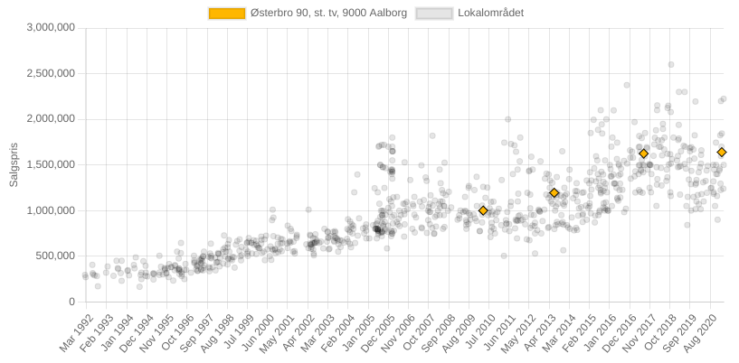

# Hjem
Dette værktøj er designet til at **støtte huskøbere** til at kunne danne sig et overblik **historiske købspriser for nærområdet** givet man har **udset sig en matrikel** (hus/lejlighed).

Værktøjet er skabt pågrund at manglende indsigt for købere i boligmarkedet, som gør det svært at lave en rimelighedsbetragtning for udbudspriser uden at blive overfuset af en ejendomsmægler.



## Anvendelse
Den simplest måde at anvende værktøjet på (for de fleste) er nok ved brug af [Docker](https://en.wikipedia.org/wiki/Docker_(software)), det er så simpelt som at køre følgende kommando:

``` shell
docker run -p 8080:8080 tpanum/hjem
```

Så er værktøjet tilgængeligt på addressen: `http://localhost:8080`. Hvis der ønsker adgang til sqlite databasen som indeholder rådata, kan den gøres tilgængelig ved at mounte `/data` mappen, e.g. tilføj argumentet `-v /data:$(pwd)/<din_mappe_her>`. Husk dog at rå data også er tilgængeligt gennem web interfacet som CSV.

### Fra source
Projektet kan også køres direkte fra source, men så skal følgende steps udføres:

1) Byg frontend: `cd frontend && npm install && npm run build && cd ..`
2) Kør webserver: `cd app && go run main.go`

Bemærk dog at dette kræver Go (version `1.16+`) og at `npm` er installeret.

## Analyserne
Værktøjet udfører nogle projekteringer som er *meget simple*, og der en masse aspekter som kan have påvirket den nuværerende udbudspris som ikke afspejles ud fra projekteringerne. Disse aspekter omfatter blandt andet:

**Aspekter som kan hæve prisen**: Tilbygning, renovering, omstrukturering af nærområdet, øget popularitet for området, øget efterspørgsel.

**Aspekter som kan sænke prisen**: Faldet popularitet for området, højere udbud, ingen renovering.


## Data
De priser som vises i værktøjet, har følgende karakteristika:

- Der vises kun priser af samme typer af matrikler, som den søgte. *Det er kun huspriser som anvendes når der søges på en matrikel som er et hus*.
- Priser som vises er kun dem som betegnes som *almindelig fritsalg*.
- Priser er for nærområdet fra den søgte matrikel (radius fra matrikel), og er ikke påvirket af postnumre.
- Som standard, filtreres indhentede priser som ligger langt fra normal området. *Denne filtrering kan dog fjernes*.

## Det med småt
Værktøjer indsamler kun data fra offentligt tilgængelige kilder, men af juridiske hensyn fraskriver mig et hvert ansvaret for de opslag værktøjet skulle udføre under sin kørsel.
